# Implementation Plan: Python DSA Learning & Practice Platform

**Document Version:** 1.0.0  
**Project Identifier:** `learn_dsa` / **AlgoLens (PyDSA)**  
**References:** [intent.md](file:///Users/anuj/workspace/learn_dsa/intent.md) | [spec.md](file:///Users/anuj/workspace/learn_dsa/spec.md)  
**Target Audience:** Engineering Team, Tech Leads, QA  

---

## 1. Project Overview & Objectives

This implementation plan defines the step-by-step roadmap for engineering the **Python Data Structures & Algorithms Learning & Practice Platform**. The platform delivers a dual-experience system:
1. **The Concept Lab (`/learn`)**: Curated algorithmic patterns with interactive time-travel visual execution, synchronized Python line highlighting, and custom input sandboxes.
2. **The Practice Arena (`/practice`)**: 45 interview-grade coding problems (2 Easy, 2 Medium, 1 Hard across 9 patterns) running native Python 3 via client-side WebAssembly (Pyodide) with an automated test suite and a 4-tier hint ladder.

---

## 2. Target File Tree & Architecture

```
learn_dsa/
├── public/
│   └── favicon.ico
├── src/
│   ├── app/
│   │   ├── layout.tsx                    # Global Layout (Navbar, Theme, Banner)
│   │   ├── page.tsx                      # Dashboard & Pattern Progress Overview
│   │   ├── globals.css                   # Tailwind styles, custom scrollbars, animations
│   │   ├── learn/
│   │   │   ├── page.tsx                  # 9 Visual Pattern Modules Catalog
│   │   │   └── [patternId]/page.tsx      # Concept Lab (Visual Stepper & Custom Inputs)
│   │   └── practice/
│   │       ├── page.tsx                  # 45-Problem Catalog (Filter by pattern/difficulty)
│   │       └── [problemId]/page.tsx      # Practice Arena (Monaco Editor & Test Runner)
│   ├── components/
│   │   ├── visualizer/                   # Visual Stepper Components
│   │   │   ├── VisualizerCanvas.tsx      # Master Canvas Dispatcher
│   │   │   ├── ArrayVisualizer.tsx       # 1D/2D Array, Pointers & Sliding Window
│   │   │   ├── LinkedListVisualizer.tsx  # Singly/Doubly Linked List Nodes & Arrows
│   │   │   ├── TreeVisualizer.tsx        # Binary Tree / BST SVG Hierarchy
│   │   │   ├── DPGridVisualizer.tsx      # 2D/1D Memoization Table & Dependency Links
│   │   │   ├── StackVisualizer.tsx       # LIFO Container with Push/Pop Animations
│   │   │   ├── StepperControls.tsx       # Timeline Scrub Slider, Play/Pause, Speed
│   │   │   ├── CustomInputSandbox.tsx    # Interactive Form for User Custom Datasets
│   │   │   └── StateInspector.tsx        # Local Variables & Call Stack Watch Panel
│   │   ├── editor/                       # Monaco & Practice Arena Components
│   │   │   ├── MonacoPythonEditor.tsx    # Monaco Editor with Python 3 autocomplete
│   │   │   ├── TestCasesPanel.tsx        # Visible Tests + Hidden Edge Cases Console
│   │   │   ├── HintLadder.tsx            # 4-Tier Progressive Reveal Component
│   │   │   └── ProblemStatement.tsx      # Markdown description, constraints & Big-O
│   │   ├── navigation/                   # UI Shell & Header
│   │   │   ├── Navbar.tsx                # Brand, Navigation Links, Theme Toggle, Backup
│   │   │   ├── PatternCard.tsx           # Category card with completion progress
│   │   │   └── BackupModal.tsx           # 1-Click JSON Export & Import Modal
│   │   └── ui/                           # Reusable UI primitives
│   │       ├── Button.tsx
│   │       ├── Badge.tsx
│   │       ├── Tabs.tsx
│   │       ├── Modal.tsx
│   │       └── Slider.tsx
│   ├── lib/
│   │   ├── pyodide/                      # Python WebAssembly & Worker Bridge
│   │   │   ├── python.worker.ts          # Dedicated Web Worker runtime
│   │   │   ├── pyodideService.ts         # Main thread RPC client with Watchdog
│   │   │   ├── tracer.py                 # sys.settrace Execution Instrumentation
│   │   │   └── testRunner.py             # Test Suite Harness & stdout capture
│   │   ├── data/                         # Static Curriculum & Visualizer Scripts
│   │   │   ├── patterns.ts               # 9 Pattern metadata, descriptions & tips
│   │   │   ├── visualizers.ts            # Visualizer scripts & default inputs per pattern
│   │   │   └── problems.ts               # 45 problems (2E/2M/1H per pattern)
│   │   ├── store/                        # Zustand Global State Stores
│   │   │   ├── useTimelineStore.ts       # Stepper playback, currentStep, speed, isPlaying
│   │   │   ├── useProgressStore.ts       # Solved problems, bookmarked, code drafts
│   │   │   └── useSettingsStore.ts       # Theme, editor font size, auto-run settings
│   │   └── utils/                        # Formatting, JSON export/import helpers
│   │       ├── exportImport.ts           # JSON backup serialization & validator
│   │       └── cn.ts                     # Tailwind class merge utility
│   └── types/                            # TypeScript Definitions
│       ├── trace.types.ts                # TraceEvent, Pointer, VisualState schemas
│       ├── curriculum.types.ts           # ProblemDefinition, TestCase, HintLadder
│       └── worker.types.ts               # WorkerRequest, WorkerResponse RPC contracts
├── intent.md
├── spec.md
├── plan.md
├── package.json
├── tailwind.config.ts
└── tsconfig.json
```

---

## 3. Phased Implementation Roadmap

```mermaid
gantt
    title Implementation Phases
    dateFormat  X
    axisFormat %d

    section Phase 1: Scaffold & Worker
    Next.js Setup & Dependencies        :p1_1, 0, 1
    Pyodide Web Worker & Watchdog       :p1_2, 1, 2
    Zustand Stores & Types              :p1_3, 1, 2

    section Phase 2: Visual Concept Lab
    Timeline Playback Controller        :p2_1, 2, 3
    Data Structure Visualizers          :p2_2, 2, 4
    Custom Input Sandbox & Code Sync    :p2_3, 3, 4

    section Phase 3: Practice Arena
    Monaco Editor & Test Runner Panel   :p3_1, 4, 5
    4-Stage Hint Ladder                 :p3_2, 4, 5

    section Phase 4: 45-Problem Catalog
    Seed 45 Problems (2E/2M/1H x 9)     :p4_1, 5, 7

    section Phase 5: Persistence & Polish
    JSON Backup Export / Import         :p5_1, 7, 8
    Theme, Shortcuts & Layout Polish    :p5_2, 7, 8
    End-to-End Verification            :p5_3, 8, 9
```



---

## 4. Detailed Engineering Phase Breakdown

### Phase 1: Project Scaffolding, Type Definitions & Pyodide Worker

#### 1.1 Project Setup & Dependencies
- Initialize Next.js 14+ project with TypeScript and Tailwind CSS.
- Install essential runtime packages:
  - `@monaco-editor/react` (Python 3 code editing)
  - `zustand` (State management)
  - `framer-motion` (Fluid pointer & node layout animations)
  - `lucide-react` (Modern developer icons)
  - `clsx` + `tailwind-merge` (Styling utilities)
  - `idb-keyval` (Fast client-side IndexedDB persistence)

#### 1.2 TypeScript Contract Definitions
- Define `TraceEvent`, `ArrayVisualState`, `LinkedListVisualState`, `TreeVisualState`, `DPGridVisualState` in `src/types/trace.types.ts`.
- Define `ProblemDefinition`, `TestCase`, `HintLadderItem`, `TopicPattern` in `src/types/curriculum.types.ts`.
- Define `WorkerRequest`, `WorkerResponse` RPC envelopes in `src/types/worker.types.ts`.

#### 1.3 Pyodide Web Worker & Watchdog Bridge
- Implement `src/lib/pyodide/python.worker.ts`:
  - Load Pyodide WASM v0.26+ from CDN or local cache.
  - Expose RPC actions: `INIT_PYODIDE`, `RUN_TESTS`, `GENERATE_TRACE`.
- Implement `src/lib/pyodide/pyodideService.ts`:
  - Main-thread wrapper managing worker lifecycle.
  - **5000ms Watchdog Timer**: Auto-terminates worker if user code enters infinite loops, respawns clean instance, and notifies UI.
- Implement `tracer.py` (`sys.settrace` execution capture) and `testRunner.py` (test harness and stdout capture).

---

### Phase 2: The Concept Lab (`/learn/[patternId]`)

#### 2.1 Timeline Playback Engine & Store (`useTimelineStore.ts`)
- State: `events: TraceEvent[]`, `currentStep: number`, `isPlaying: boolean`, `speed: number` ($0.5\times$ to $3.0\times$).
- Actions: `play()`, `pause()`, `stepForward()`, `stepBackward()`, `seekTo(step)`, `setSpeed(multiplier)`.
- Global keyboard bindings: `Space` (Play/Pause), `ArrowLeft` (Step Back), `ArrowRight` (Step Forward).

#### 2.2 Dedicated Visualizer Canvas Renderers
- **`ArrayVisualizer.tsx`**:
  - Horizontal indexed grid with Framer Motion layout animations.
  - Animated pointer pills (`left`, `right`, `slow`, `fast`, `pivot`) with distinct Tailwind color tokens.
  - Bounding box overlay for sliding window $[L, R]$.
  - Arc translation animation for swapping elements.
- **`LinkedListVisualizer.tsx`**:
  - Node boxes with value, address/id, and directed SVG arrow connectors.
  - Animated pointer tags (`head`, `curr`, `prev`, `fast`, `slow`).
- **`TreeVisualizer.tsx`**:
  - Hierarchical tree layout with nodes, connecting branches, and visit highlight rings.
- **`DPGridVisualizer.tsx`**:
  - 2D/1D table matrix with row/col labels, active calculating cell pulse, formula tooltip, and dependency connectors.
- **`StackVisualizer.tsx`**:
  - Vertical/horizontal container with push/pop slide transitions and Top marker.

#### 2.3 Custom Input Sandbox & Code Synchronizer
- **`CustomInputSandbox.tsx`**:
  - Dynamic input form allowing users to change default parameters (e.g. `nums = [1, 3, 5, 8, 12]`, `target = 8`).
  - Re-triggers tracer in Pyodide worker and updates the timeline instantly.
- **`StateInspector.tsx` & Code Highlighting**:
  - Line-by-line highlight synchronizer matching `TraceEvent.line`.
  - Explanation card with step rationale and local variable values watch-table.

---

### Phase 3: The Practice Arena (`/practice/[problemId]`)

#### 3.1 Monaco Editor Integration
- Embedded Python 3 editor with custom dark/light theme integration.
- Keyboard shortcuts: `Ctrl/Cmd + Enter` to run tests, `Ctrl/Cmd + S` to save draft.
- Reset boilerplate starter code button.

#### 3.2 Automated Test Runner Console (`TestCasesPanel.tsx`)
- Visible test cases tabs displaying Input, Expected Output, Actual Output, and captured `stdout`.
- Hidden Edge Cases evaluation (Empty array, single element, negative numbers, large constraints) with clear pass/fail summary badge.
- Execution metrics display: Execution time ($\text{ms}$) and status (`Passed`, `Wrong Answer`, `Runtime Error`, `Timeout`).

#### 3.3 4-Stage Progressive Hint Ladder (`HintLadder.tsx`)
- 4 accordion tiers with gradual unlock:
  - *Tier 1: Pattern Recognition Hint*
  - *Tier 2: Invariant & Algorithmic Strategy*
  - *Tier 3: Python Pseudocode & Complexity Target*
  - *Tier 4: Full Canonical Solution with Line-by-Line Breakdown*

---

### Phase 4: Curated 45-Problem Curriculum Seeding ($9 \times 5$)

Create `src/lib/data/problems.ts` containing all **45 problems** (2 Easy, 2 Medium, 1 Hard per pattern) with complete problem statements, constraints, Python starter code, solution code, test cases, and hint ladders:

| Pattern | Easy 1 | Easy 2 | Medium 1 | Medium 2 | Hard |
| :--- | :--- | :--- | :--- | :--- | :--- |
| **1. Two Pointers** | Valid Palindrome | Two Sum II | 3Sum | Container With Most Water | Trapping Rain Water |
| **2. Sliding Window** | Max Average Subarray I | Defuse the Bomb | Longest Substring Without Repeating | Min Size Subarray Sum | Sliding Window Maximum |
| **3. Linked Lists** | Reverse Linked List | Merge Two Sorted Lists | Linked List Cycle II | Remove Nth Node From End | Merge K Sorted Lists |
| **4. Stacks & Queues** | Valid Parentheses | Implement Queue via Stacks | Daily Temperatures | Min Stack | Largest Rectangle in Histogram |
| **5. Trees & BSTs** | Invert Binary Tree | Max Depth of Binary Tree | Lowest Common Ancestor | Binary Tree Level Order | Binary Tree Max Path Sum |
| **6. Binary Search** | Binary Search | First Bad Version | Search in Rotated Array | Find Peak Element | Median of Two Sorted Arrays |
| **7. Graph Traversals** | Flood Fill | Path Exists in Graph | Number of Islands | Clone Graph | Word Ladder |
| **8. Dynamic Programming** | Climbing Stairs | House Robber | Coin Change | Longest Common Subsequence | Edit Distance |
| **9. Backtracking** | Binary Tree Paths | Sum of Subset XOR Totals | Subsets | Combination Sum | N-Queens |

---

### Phase 5: Persistence, Data Portability & Polish

#### 5.1 Local Persistence & JSON Backup (`exportImport.ts`)
- Store completed problems, bookmarked problems, custom code drafts, and preferences in `localStorage` / IndexedDB via `useProgressStore.ts`.
- **Export Backup**: Download `algolens_progress_backup.json` containing timestamped user progress and code drafts.
- **Import Backup**: Validate JSON schema, restore progress and drafts, and notify user of successful restore.

#### 5.2 Responsive Layout & Dark/Light Theme
- Resizable split-pane layout using CSS flex / `react-resizable-panels`.
- High-contrast Dark and Light color palettes for optimal readability.
- Quick navigation shortcuts and completion badges across all pattern cards.

---

## 5. Verification & Testing Matrix

| Test Domain | Verification Target | Method / Tool | Pass Criteria |
| :--- | :--- | :--- | :--- |
| **Pyodide Worker** | Worker initialization, script execution, stdout capture | Unit test / Worker ping | Worker responds with `PYODIDE_READY` $<1.5\text{s}$, executes test $<100\text{ms}$. |
| **Watchdog Timeout** | Infinite loop (`while True: pass`) | Test Harness | Worker terminated and respawned after $5000\text{ms}$; UI displays timeout warning without freezing. |
| **Visual Stepper Sync** | Timeline scrub and step navigation | Manual & Component Test | Code highlight line and visualizer pointers match exact step index $i$. |
| **Custom Inputs** | User modifies array/target values | Interactive Test | Tracer re-executes and timeline re-populates with new events without UI crashes. |
| **Practice Test Suite** | 45 problems starter & solution code | Automated Runner | All 45 canonical solutions pass 100% of visible and hidden test cases. |
| **Backup / Restore** | JSON Export and Import | Data Integrity Test | Exported JSON accurately restores code drafts and solved statuses in fresh browser session. |

---

## 6. Risk Mitigation Strategy

1. **Pyodide Cold-Start Latency**:
   - *Mitigation*: Initialize the Pyodide Web Worker in the background as soon as the application shell loads; show an unobtrusive skeleton loading indicator during first load.
2. **Infinite Loops in User Code**:
   - *Mitigation*: $5000\text{ms}$ watchdog timer in `pyodideService.ts` that terminates the worker and provides an immediate recovery prompt.
3. **Monaco Editor Bundle Size**:
   - *Mitigation*: Dynamically import `@monaco-editor/react` using Next.js `dynamic(..., { ssr: false })` to avoid SSR overhead and keep initial page load lightweight.
4. **Large Trace Event Memory Footprint**:
   - *Mitigation*: Limit tracer to 1000 steps max; sanitize variable snapshots to primitive types and shallow collections.
