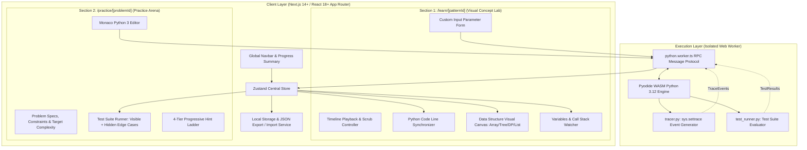

# Technical Specification Document: Python DSA Learning & Practice Platform

**Document Version:** 1.1.0 (Synchronized with Final Intent)  
**Project Identifier:** `learn_dsa` / **AlgoLens (PyDSA)**  
**Status:** Approved for Engineering Implementation  
**Target Audience:** Frontend Engineers, Systems Engineers, UX Engineers, QA  

---

## 1. System Architecture & Routing Structure

### 1.1 Routing Architecture (Next.js App Router)

The application separates conceptual learning from hands-on coding practice into two distinct, high-focus sections:

```
src/app/
├── layout.tsx                # Global layout with Top Navigation & Theme Provider
├── page.tsx                  # Home Dashboard & Pattern Progression Overview
├── learn/                    # [Section 1: The Concept Lab]
│   ├── page.tsx              # Index of all 9 Visual Pattern Modules
│   └── [patternId]/page.tsx  # Interactive Visual Stepper with custom input sandbox
└── practice/                 # [Section 2: The Practice Arena]
    ├── page.tsx              # 45-Problem Catalog (filter by Pattern & Difficulty)
    └── [problemId]/page.tsx  # Monaco Python Editor & Automated Test Harness
```

### 1.2 High-Level Component Topology



---

## 2. Core Data Models & Schemas

### 2.1 Trace Event Schema (`TraceEvent`)

```typescript
export type EventType = 
  | 'LINE'           // Line executed
  | 'CALL'           // Function entry
  | 'RETURN'         // Function return
  | 'POINTER_MOVE'   // Specific pointer shifted (e.g. left += 1)
  | 'COMPARE'        // Element comparison (e.g. nums[i] < nums[j])
  | 'SWAP'           // Element swap in array
  | 'VISIT_NODE'     // Tree/Graph node visited
  | 'UPDATE_DP_CELL' // DP Table cell calculation
  | 'PUSH_STACK'     // Stack push
  | 'POP_STACK';     // Stack pop

export interface CallStackFrame {
  functionName: string;
  line: number;
  args: Record<string, any>;
  locals: Record<string, any>;
}

export interface TraceEvent {
  stepIndex: number;
  line: number;                     // 1-indexed source code line number
  eventType: EventType;
  explanation: string;              // Clear human explanation of this step
  codeSnippet?: string;             // Exact code expression evaluated
  variables: Record<string, any>;   // Global/local variable state snapshot
  callStack: CallStackFrame[];      // Current call stack frames
  dataStructureState: DataStructureState; // Specialized state for visual canvas
}

export type DataStructureState =
  | ArrayVisualState
  | LinkedListVisualState
  | TreeVisualState
  | StackQueueVisualState
  | DPGridVisualState
  | GraphVisualState;
```

### 2.2 Specialized Visualizer States

#### A. Array & Pointer State (`ArrayVisualState`)
```typescript
export interface ArrayPointer {
  id: string;               // e.g., 'left', 'right', 'slow', 'fast', 'pivot'
  name: string;             // Display label
  index: number;            // Current array index
  color: string;            // Tailwind color token (e.g., 'indigo', 'emerald', 'rose')
}

export interface ArrayElement {
  index: number;
  value: number | string;
  state: 'default' | 'active' | 'compared' | 'swapping' | 'sorted' | 'window';
}

export interface SlidingWindowBoundary {
  startIndex: number;
  endIndex: number;
  label?: string;
}

export interface ArrayVisualState {
  type: 'ARRAY';
  elements: ArrayElement[];
  pointers: ArrayPointer[];
  window?: SlidingWindowBoundary;
  highlightIndices?: number[];
  auxiliaryArray?: ArrayElement[];
}
```

#### B. Linked List State (`LinkedListVisualState`)
```typescript
export interface LinkedListNode {
  id: string;
  value: number | string;
  nextId: string | null;
  prevId?: string | null;
  state: 'default' | 'current' | 'visited' | 'modified';
}

export interface LinkedListVisualState {
  type: 'LINKED_LIST';
  nodes: LinkedListNode[];
  pointers: {
    name: string;                  // 'head', 'curr', 'prev', 'fast', 'slow'
    targetNodeId: string | null;
    color: string;
  }[];
}
```

#### C. Binary Tree State (`TreeVisualState`)
```typescript
export interface TreeNode {
  id: string;
  value: number | string;
  leftId: string | null;
  rightId: string | null;
  state: 'unvisited' | 'active' | 'processing' | 'completed' | 'match';
}

export interface TreeVisualState {
  type: 'TREE';
  rootId: string | null;
  nodes: Record<string, TreeNode>;
  currentNodeId: string | null;
  traversalOrder: string[];
}
```

#### D. Dynamic Programming Table State (`DPGridVisualState`)
```typescript
export interface DPCell {
  row: number;
  col: number;
  value: number | string | null;
  state: 'uncomputed' | 'computing' | 'computed' | 'base_case';
  dependsOn?: Array<{ row: number; col: number }>;
}

export interface DPGridVisualState {
  type: 'DP_GRID';
  dimensions: { rows: number; cols: number };
  rowHeaders?: string[];
  colHeaders?: string[];
  grid: DPCell[][];
  activeCell: { row: number; col: number } | null;
  formulaDescription?: string;
}
```

---

## 3. The 45-Problem Curated Curriculum ($9 \times 5$)

The platform ships with exactly **45 high-frequency interview problems** organized across the **9 essential patterns**, with **2 Easy, 2 Medium, and 1 Hard** problem in each pattern:

```typescript
export type ComplexityClass = 'O(1)' | 'O(log n)' | 'O(n)' | 'O(n log n)' | 'O(n^2)' | 'O(2^n)';
export type DifficultyLevel = 'Easy' | 'Medium' | 'Hard';

export interface TestCase {
  id: string;
  input: Record<string, any>;
  expectedOutput: any;
  isHidden?: boolean;              // Hidden edge case test
  explanation?: string;
}

export interface HintLadderItem {
  level: 1 | 2 | 3 | 4;
  title: string;
  content: string;
}

export interface ProblemDefinition {
  id: string;
  patternId: string;
  title: string;
  slug: string;
  difficulty: DifficultyLevel;
  timeComplexity: ComplexityClass;
  spaceComplexity: ComplexityClass;
  descriptionMarkdown: string;
  constraints: string[];
  starterCode: string;
  solutionCode: string;
  testCases: TestCase[];
  hints: HintLadderItem[];
}
```

### Complete 45-Problem Distribution Matrix

| Pattern ID & Name | Easy Problem 1 | Easy Problem 2 | Medium Problem 1 | Medium Problem 2 | Hard Problem |
| :--- | :--- | :--- | :--- | :--- | :--- |
| **1. Two Pointers** | Valid Palindrome | Two Sum II (Sorted) | 3Sum | Container With Most Water | Trapping Rain Water |
| **2. Sliding Window** | Maximum Average Subarray I | Defuse the Bomb | Longest Substring Without Repeating Characters | Minimum Size Subarray Sum | Sliding Window Maximum |
| **3. Linked Lists** | Reverse Linked List | Merge Two Sorted Lists | Linked List Cycle II | Remove Nth Node From End | Merge K Sorted Lists |
| **4. Stacks & Queues** | Valid Parentheses | Implement Queue using Stacks | Daily Temperatures | Min Stack | Largest Rectangle in Histogram |
| **5. Trees & BSTs** | Invert Binary Tree | Maximum Depth of Binary Tree | Lowest Common Ancestor of BST | Binary Tree Level Order Traversal | Binary Tree Maximum Path Sum |
| **6. Binary Search** | Binary Search | First Bad Version | Search in Rotated Sorted Array | Find Peak Element | Median of Two Sorted Arrays |
| **7. Graph Traversals** | Flood Fill | Find if Path Exists in Graph | Number of Islands | Clone Graph | Word Ladder |
| **8. Dynamic Programming** | Climbing Stairs | House Robber | Coin Change | Longest Common Subsequence | Edit Distance |
| **9. Backtracking** | Binary Tree Paths | Sum of All Subset XOR Totals | Subsets | Combination Sum | N-Queens |

---

## 4. Python Web Worker & Execution Safety

### 4.1 Pyodide Web Worker Architecture (`python.worker.ts`)
* Worker loads Pyodide 0.26+ via WebAssembly.
* Watchdog Timer ($5000\text{ms}$) monitors message processing. If an execution exceeds $5000\text{ms}$ (infinite `while` loop or unpruned recursion), the parent thread terminates the worker (`worker.terminate()`), respawns a fresh worker instance, and returns a user-friendly timeout error.

### 4.2 Web Worker RPC Messages
```typescript
export type WorkerRequest =
  | { type: 'INIT_PYODIDE' }
  | { type: 'RUN_TESTS'; payload: { code: string; entryFunction: string; testCases: TestCase[] } }
  | { type: 'GENERATE_TRACE'; payload: { visualizerCode: string; entryFunction: string; customInputs: Record<string, any> } };

export type WorkerResponse =
  | { type: 'PYODIDE_READY' }
  | { type: 'INIT_ERROR'; error: string }
  | { type: 'TESTS_COMPLETED'; payload: { success: boolean; allPassed: boolean; results: any[]; error?: string } }
  | { type: 'TRACE_COMPLETED'; payload: { events: TraceEvent[]; result: any } }
  | { type: 'EXECUTION_TIMEOUT' }
  | { type: 'EXECUTION_ERROR'; error: string };
```

---

## 5. Visualizer Canvas Component Specifications

### 5.1 Array & Two-Pointer Visualizer (`ArrayVisualizer.tsx`)
* **Layout**: Centered horizontal flex row of indexed memory cells with Framer Motion layout animations.
* **Pointers**: Visual badges (`left`, `right`, `slow`, `fast`, `pivot`) positioned above/below cells with distinct color tokens.
* **Sliding Window**: Animated bounding box overlay spanning $[L, R]$ with dynamic width computation.
* **Swaps**: Animated arc displacement when elements swap positions.

### 5.2 Dynamic Programming Grid Visualizer (`DPGridVisualizer.tsx`)
* **Layout**: 2D grid matrix with row/col labels (e.g. for `Coin Change`, `LCS`, `Edit Distance`).
* **States**:
  - `uncomputed`: Subtle gray outline.
  - `computing`: Pulsing yellow border with tooltip formula (e.g., $\min(dp[i-1][j], dp[i][j-w]) + 1$).
  - `computed`: Filled green/blue badge.
  - `dependsOn`: Directed visual connectors to previous subproblem cells.

### 5.3 Binary Tree Visualizer (`TreeVisualizer.tsx`)
* **Layout**: SVG hierarchical tree layout with animated edge lines.
* **Nodes**: Circular nodes with visit state styling (`unvisited`, `active`, `processing`, `completed`).

---

## 6. Persistence & Data Portability Schema

### 6.1 Local Storage Schema (`dsa_user_data`)
```typescript
export interface UserProgressData {
  version: '1.1.0';
  completedProblemIds: string[];
  bookmarkedProblemIds: string[];
  customDrafts: Record<string, string>; // problemId -> user python code
  settings: {
    theme: 'dark' | 'light';
    playbackSpeed: number;
    editorFontSize: number;
  };
  lastActivePatternId: string;
}
```

### 6.2 1-Click JSON Backup & Restore API
* **Export**: Serializes `UserProgressData` to a downloadable file `algolens_progress_backup.json`.
* **Import**: Validates JSON schema structure, restores user code drafts and solved status into IndexedDB/LocalStorage, and refreshes application state.

---

## 7. Next Implementation Steps
1. Initialize Next.js 14+ project in `/Users/anuj/workspace/learn_dsa`.
2. Configure Tailwind CSS, Lucide-React, and Framer Motion.
3. Build Pyodide Web Worker runner and tracer script.
4. Build the Visual Stepper Canvas components and Custom Input Sandbox for `/learn`.
5. Build the Monaco Code Editor, Hint Ladder, and Test Case Console for `/practice`.
6. Seed the 45 curated problems across the 9 patterns.
